# TripShield — AI Architecture

How a flight cancellation becomes a re-arranged trip, and where in that pipeline
a model is actually doing the work.

The short version: **models personalize; the server decides what is true and
safe.** Whether a member can still reach a timed park entry is arithmetic, and
arithmetic can be tested. The graph, supplier facts, feasibility rules, plan
materialization, Pareto eligibility and execution saga remain deterministic.
Bounded Flight, Accommodation, Activity, Dining and Ground AI agents search and
assess permitted read-only inventory. A final Recommendation AI orders the
validated Pareto-eligible plans for this member and explains the trade-offs.

No model may invent an offer, change a price or time, approve a charge, or execute
a transaction. Every model-selected identifier is checked against the immutable
request snapshot. If any model fails, its stage falls back to deterministic logic;
if the final Recommendation AI fails, the deterministic scalarised order remains
the member-visible recommendation.

---

## 1. The whole system

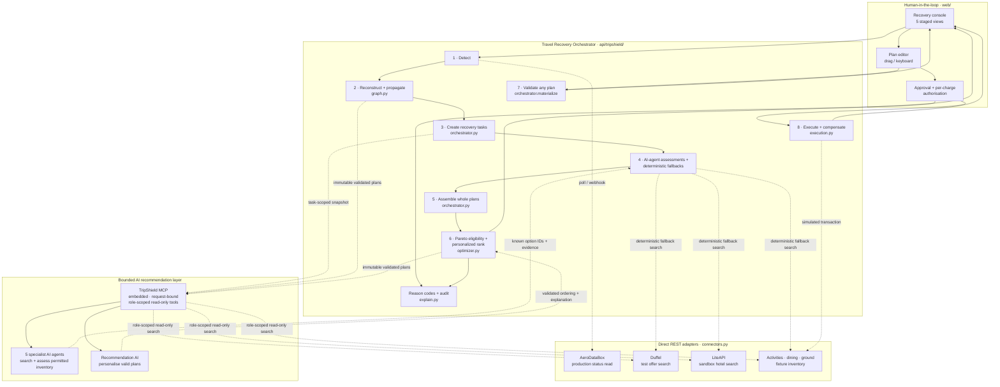

MCP is not the supplier transport. Its read-only search tools call TripShield's
ordinary connector layer; AeroDataBox, Duffel and LiteAPI remain HTTP clients with
explicit deadlines, caching and deterministic fixture fallbacks. The model never
receives arbitrary HTTP or web-scraping access. Every booking, change,
cancellation, refund and payment remains simulated even when a candidate came
from a production or sandbox read.

---

## 2. Detection — event-driven, not user-reported

The member never tells the system anything. A scheduled sweep and the carrier's
alert webhook both land on the same code path, which is also what the *Check my
flights* button calls.

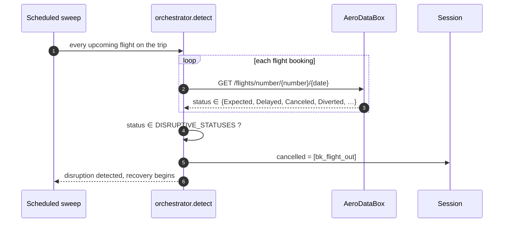

`Canceled` (one *l*), `CanceledUncertain` and `Diverted` are AeroDataBox's own
vocabulary, used verbatim rather than re-mapped. This connector runs **live**
against the real API when `AERODATABOX_API_KEY` is set. Without a usable response,
the same detection path returns a recorded fixture with fallback provenance.

---

## 3. The dependency graph — where the reasoning is deterministic

The trip is a DAG, not a list. Two bookings can be adjacent in time and unrelated;
two can be days apart and one cannot happen without the other.

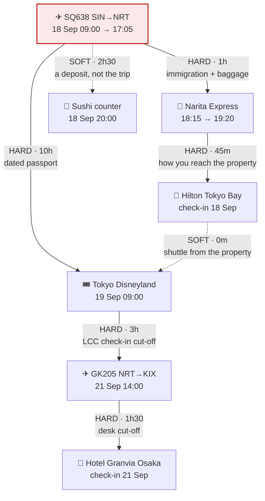

Propagation is one pass in topological order, and the rule is arithmetic:

```
earliest_reachable = free_at(upstream) + edge.min_buffer

if earliest_reachable > deadline(node):
    HARD edge  → BROKEN
    SOFT edge  → AT_RISK
```

Three refinements that took real bugs to find:

| Rule | Why it exists |
| --- | --- |
| `free_at` is a stay's **check-in**, not its check-out | Otherwise a 3-night booking looks like it blocks the whole trip |
| A **replacement is still checked** against its own edges | Otherwise a hotel option can assert a check-in the member cannot make |
| A **dropped** booking is spliced out, not cascaded | Giving up the transfer does not mean giving up the hotel — you still have to get there |

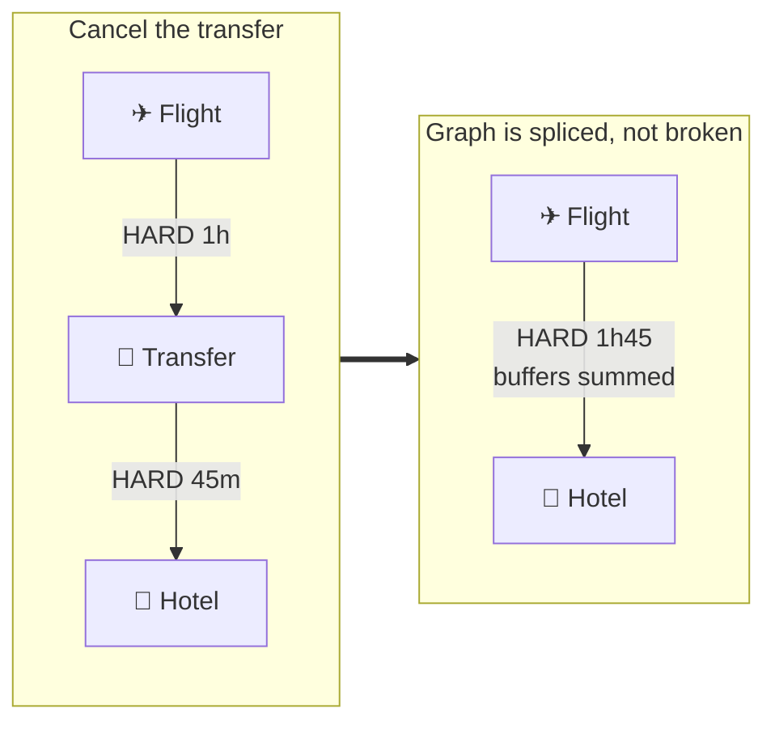

---

## 4. Task creation and AI-agent fan-out

The orchestrator creates tasks **dynamically**, per candidate flight — because a
different arrival breaks a different set of things. These are bounded model
agents, not independent services: the orchestrator owns their lifecycle, timeout,
tool allowlist, input snapshot and output validation.

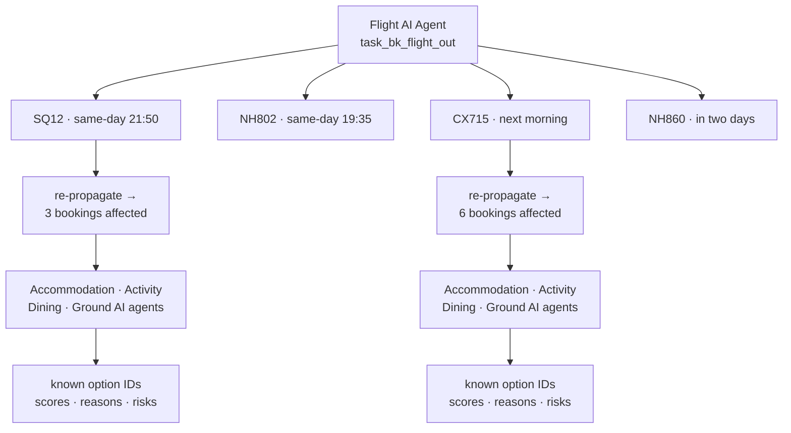

Each task carries the constraint its **own edge** demands, not a constant:

```json
{
  "id": "task_bk_activity_tdl_ft_cx715",
  "agent": "Activity AI Agent",
  "objective": "Restore “Attraction” given the replacement arrival",
  "constraints": {
    "arrival": "2026-09-19T19:40:00+09:00",
    "arrival_buffer_minutes": 600,
    "must_end_before": "2026-09-21T11:00:00+09:00",
    "priority": "inferred"
  },
  "tools": ["get_recovery_task", "search_activity_inventory", "inspect_option"]
}
```

Model agents have no `book`, `cancel`, `approve`, `pay` or arbitrary HTTP tool.
The server binds the task ID and specialty to every tool call, so an Activity
agent cannot search hotel inventory or inspect another request.

Agents return **several** known options with a reason for every rejection — the
rejections are the part that makes the recommendation believable:

```
flights.search_offers → 4 candidates
  ✓ SQ12 · same-day evening direct        +SGD 180
  ✓ NH802 · earlier same-day direct       +SGD 320
  ✗ ruled out opt_lod_transit: the replacement leaves the same day —
    there is no night to cover
```

### Three model-call waves

The Flight AI runs first because the replacement arrival determines the recovery
graph. The server deterministically filters its inventory and retains a bounded
set of viable flight roots. It re-propagates the graph for each root, groups the
resulting work by specialty, and then runs four **batched** specialist calls in
parallel:

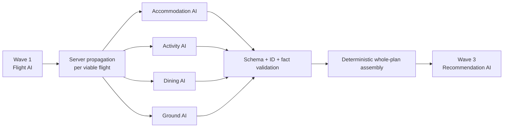

There are at most six model calls in the normal path: Flight, four concurrent
downstream specialists, then Recommendation. A semaphore, per-call deadlines and
an overall request budget prevent fan-out from exceeding the deployment limit.
One specialist failure replaces only that specialist's assessment with the
deterministic option ordering; it does not discard successful agent work.

### Specialist output contract

Each specialist returns structured data containing only:

- the task and option IDs it inspected;
- preference scores, reasons, risks and rejection reasons;
- recommended IDs drawn from the returned connector inventory; and
- provider, model, duration and completion or fallback status.

The schema contains no price, time, availability or supplier fields that a model
could overwrite. Unknown IDs, cross-specialty IDs and malformed output invalidate
that agent result. Connector provenance (`live`, `sandbox`, `fixture`, or
`synthetic`) remains attached by server code and is never inferred by a model.

---

## 5. Plan assembly — whole answers, not a shortlist

The failure mode this avoids: asking each agent for its single best option and
stapling the results together produces a plan nobody chose, whose totals describe
no trip the member could actually take.

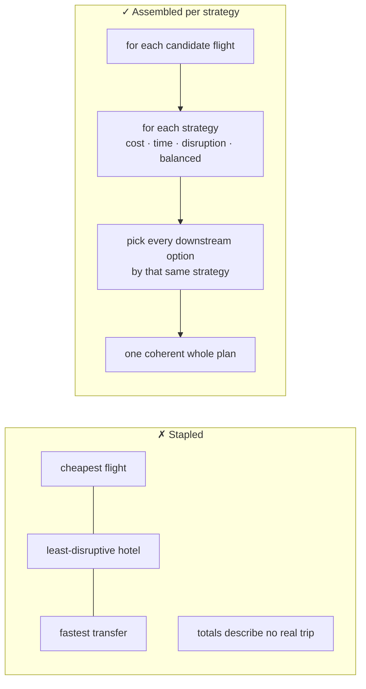

---

## 6. Eligibility and personalized ranking

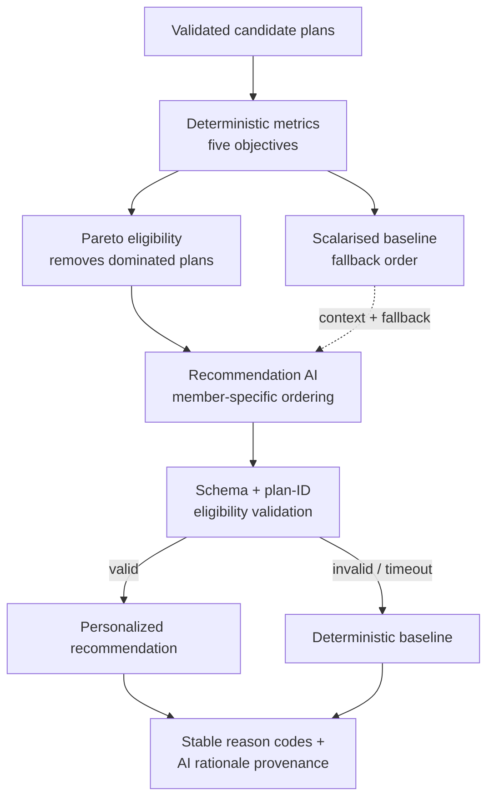

```
score = money
      + hours          × time value
      + bookings moved × switching cost
      + experience given up
      + fragility      × reliability weight
```

| Objective | Guards against |
| --- | --- |
| Money | — |
| Time | — |
| Disruption | Churn for its own sake |
| **Experience** | Winning by quietly deleting the trip |
| **Fragility** | Calling a plan safe because its *flight* is direct |

**Experience** is priced at `1.5 ×` what was paid. A purchase reveals
willingness-to-pay at or *above* the price, so valuing the loss at exactly the
price makes a refund cancel it out perfectly and "delete the day, take the money
back" reads as free.

**Fragility** compounds across legs, and released bookings stay in the product —
giving up a reserved transfer does not make the evening more reliable, it puts
the member on an unmanaged fallback.

The five metrics and Pareto front remain server-owned facts. The scalarised score
is a transparent baseline and total-model-failure fallback. The Recommendation AI
may reorder only the validated Pareto-eligible plan IDs. This makes personalization
a real model decision without allowing the model to declare an infeasible or
strictly dominated trip the winner.

The response also identifies useful alternatives such as lowest cost, fastest
recovery and least disruption. Those labels are recomputed from deterministic
metrics; the model supplies the member-specific explanation and trade-offs.

### Where the Recommendation AI sits

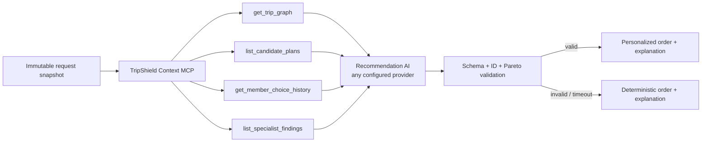

Both providers use the same in-process, request-bound MCP server. Each agent gets
a role-specific tool allowlist: specialists can read their task and search or
inspect their specialty inventory; the Recommendation AI can read the graph,
member context, validated candidate plans and specialist findings. The server
exposes no write or transaction tools and no state beyond the current request.

The final structured response contains a recommended plan ID, an ordered subset of
eligible plan IDs, member-specific reasons, trade-offs, warnings, confidence and
referenced evidence IDs. The server rejects unknown IDs, duplicate or ineligible
recommendations, altered facts and evidence that is absent from the snapshot.

Interactive preference changes rerun only the Recommendation AI against the same
validated inventory snapshot. Specialist agents run again only when inventory,
the disruption, or the graph has changed. Until the fresh response is validated,
the UI hides the old AI rationale and displays the deterministic baseline.

The active provider is chosen with `AI_PROVIDER=anthropic|openai`. If it is unset,
Anthropic is preferred when configured, then OpenAI. An explicitly selected but
unconfigured provider fails closed rather than crossing providers. Timeouts, rate
limits, tool-loop errors and invalid structured output all preserve the existing
deterministic result. The UI says when the deterministic fallback was used and
never labels that result as AI-personalized.

Deployment uses `AI_PROVIDER=openai` and the secret `openai_api_key` on Render,
which is where the backend runs. The runtime also accepts the conventional uppercase
`OPENAI_API_KEY` name for local development.

`OPENAI_MODEL` defaults to the cheap tier rather than the flagship. These agents rank
options against constraints already checked server-side and write one line of rationale,
which is small bounded work: measured at roughly a second a call against several for the
flagship, at a fraction of the price.

`OPENAI_BASE_URL` redirects the same client at any OpenAI-compatible endpoint. That is
the whole free-tier story, since OpenAI has no free tier but its wire protocol is spoken
by providers that do, and tool calling and strict structured output are untouched by the
swap.

### Provider failures that are not outages

Three of these cost a call, or look like they should have, and each was mistaken for
something else before it was understood. They are recorded because the next person will
otherwise read the same symptom the same wrong way.

| Symptom | Actual cause | Where it is handled |
| --- | --- | --- |
| Every agent fails identically, whatever the billing state | Strict mode rejects `uniqueItems`, and strict function calling requires `additionalProperties: false` with every property named in `required`. FastMCP derives tool schemas from the Python signature and emits neither, so the request is refused before it is costed | `ai.py` normalises every schema at the provider boundary |
| Every failure reports the same generic provider error | Agents run concurrently, so the provider exception arrives wrapped in an `ExceptionGroup`; classifying the wrapper discards the cause | `_exception_code` unwraps before it classifies |
| The model "did not answer in time", uniformly, to the millisecond | A default deadline the work does not fit inside. A bounded agent measures 10 to 23 seconds against a current model | The default is 45 seconds; lower it deliberately, not by omission |

Two more are worth stating because they trade cost against reliability rather than
correctness. Output is capped, but the cap scales with the work an agent was given: a
specialist returns every option id for every one of its tasks, so eight lodging tasks
cannot be enumerated in the same breath as one flight, and a truncated answer fails
validation and wastes the tokens already spent. And an agent gets one retry when its
answer fails validation, because the validators are exacting on purpose and a model slip
is not deterministic; the retry costs a second call only when the first was going to be
discarded anyway.

### What crosses the boundary

The snapshot is a projection, not the full record. An agent choosing between options
needs what tells them apart, not the plumbing that books them, so adapter calls, offer
ids, connector keys, provenance and the synthetic flag stay server-side where execution
and the audit trail need them:

```
  before   110,562 chars   ~27,600 input tokens per plan request
  after     55,537 chars   ~13,900 input tokens per plan request
```

Profile features and choice history are server-created inputs. The model may use
them to make a contextual preference decision, but it cannot rewrite the stored
profile, metric values or scalarised score. A stable, non-PII request safety
identifier is passed to providers that support one.

---

## 7. Human-in-the-loop — the browser never decides

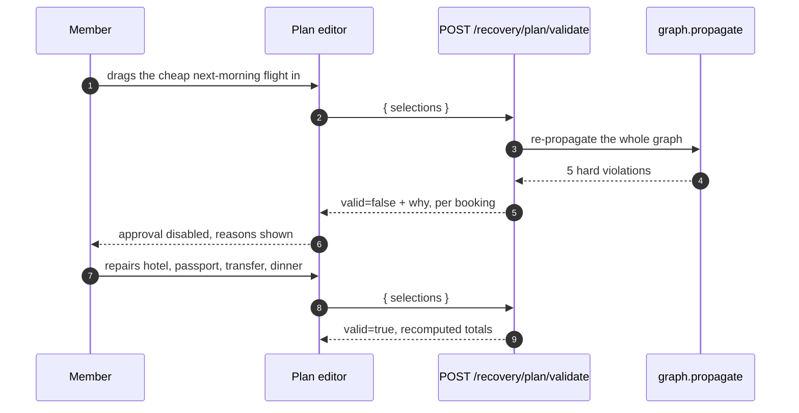

If the frontend were allowed to compute feasibility it would quietly become the
source of truth, and it would be wrong the first time a supplier rule changed.

---

## 8. Execution — a saga, not a batch

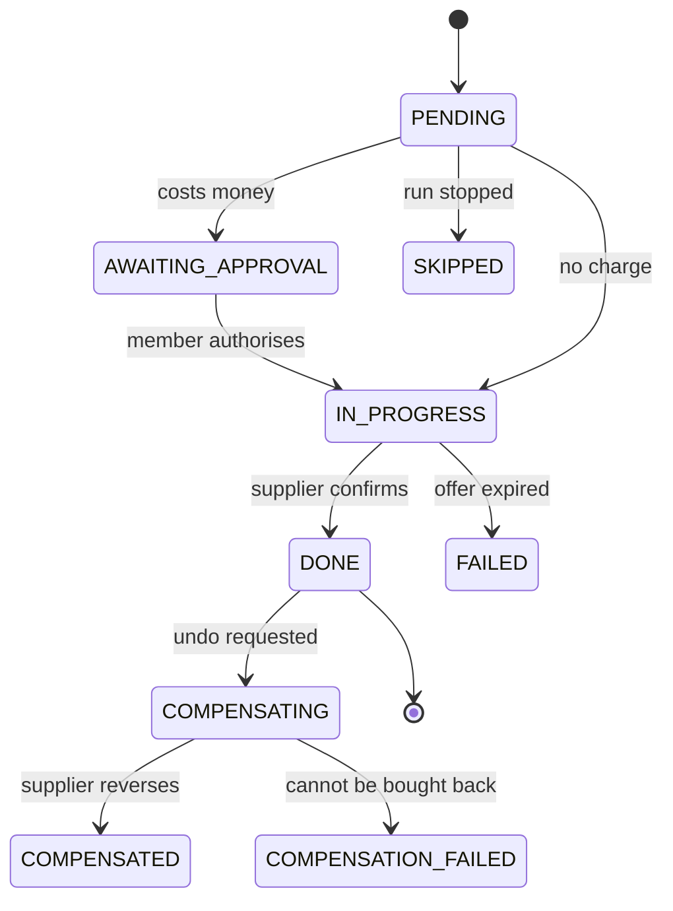

Steps run **one at a time in dependency order** — the hotel amendment is only
correct once the replacement flight is ticketed. Each charge is authorised
individually; the plan-level approval only queues the work.

### Cancel is two different words

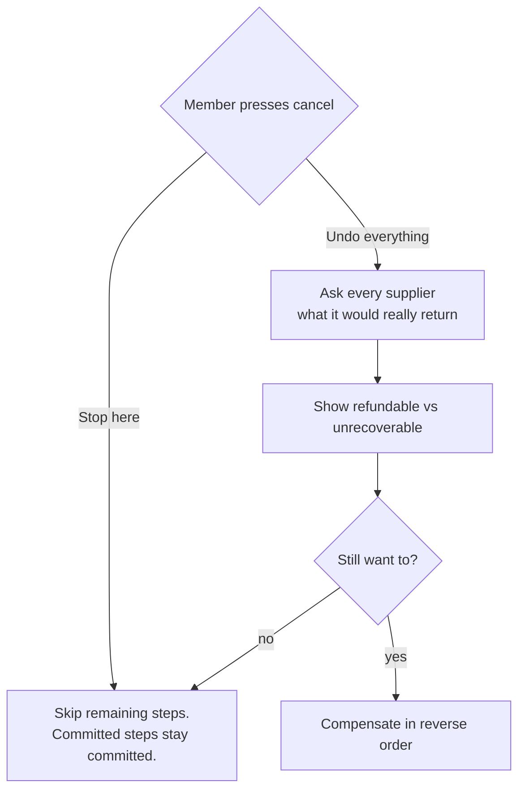

Rollback is quoted before it runs because it is neither free nor always possible:

| Step type | Reversing it |
| --- | --- |
| Flight change (Duffel) | Refund **net of the airline's fee** |
| Hotel amendment (LiteAPI) | Usually full refund |
| Same-day dining cancellation | Nothing comes back |
| A step that **gave a booking up** | Not a refund at all — a re-purchase at today's price, if the inventory still exists |

---

## 9. Accountability

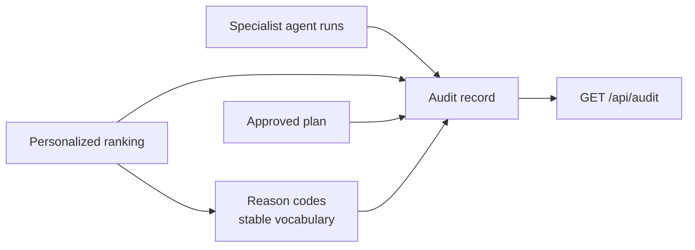

An audit record is written at **approval**, not at execution — the question
worth answering months later is usually "why was this offered", not "did the
booking succeed". It carries the recommendation, the member's actual choice,
every candidate's score, the Pareto front, the deterministic fallback order, and
the agent provider, model, duration, status, tool evidence IDs and fallback reason.
It never stores provider credentials or raw secrets.

The gap between `recommended_plan_id` and `selected_plan_id` is the single most
useful signal the system produces about whether its ranking matches what members
actually want.

---

## 10. Trust boundaries

| Boundary | Rule |
| --- | --- |
| Frontend → feasibility | The browser proposes; the server decides. Always. |
| API data → outbound links | Allowlisted to `https://…americanexpress.com` at the render boundary, so it holds whichever connector produced the link |
| Supplier → Amex partner | Exact normalized name or explicit alias in the same category and market; never fuzzy inference |
| Plan display → plan approval | `Option` is rebuilt from its own field list, so a new field cannot silently default and make the approved plan differ from the displayed one |
| REST connector reads | AeroDataBox may be live; Duffel and LiteAPI are sandbox; every failure falls back to fixtures with provenance |
| Connector transactions | Fixture-only. A demonstration must not transact against live inventory |
| Model MCP | Role-scoped read-only tools over an immutable request snapshot; no public MCP endpoint, arbitrary HTTP, scraping, write, approval or transaction tool |
| Model → inventory facts | Models return known IDs and assessments only; server-owned `Option` objects remain the source of price, time, availability, supplier and provenance |
| Model → recommendation | The recommended ID must be a validated Pareto-eligible plan; invalid or unavailable output uses the deterministic order |
| Execution runs | Never reconstructed from seed data — a missing run returns `410`, because it records transactions that actually happened |

The Amex partner catalog is curated from official Amex pages and records when an
entry was verified. It is updated as reviewed source code, not by runtime scraping.
Viator's official Experiences MCP is documented but deferred; activities remain
fixtures, as do dining and ground transport.

---

## 11. Module map

| Module | Responsibility | Deterministic? |
| --- | --- | --- |
| `domain.py` | Shared vocabulary and types | ✔ |
| `catalog.py` | The member's booking history | ✔ |
| `graph.py` | Dependency graph, propagation, splicing | ✔ |
| `connectors.py` | Direct REST reads, provenance and fixture fallbacks | ✔ (external reads vary) |
| `amex_partners.py` | Curated official-source partner catalog and exact matching | ✔ |
| `mcp_server.py` | Embedded request-bound MCP with per-agent tool policy | Read-only |
| `ai.py` | Provider-neutral tool loop, schemas, deadlines and output validation | Model-backed |
| `ai_agents.py` | Five specialist agents and the Recommendation AI | Model-backed with deterministic fallback |
| `agents.py` | Connector search, hard feasibility and deterministic specialist fallback | ✔ |
| `orchestrator.py` | Task creation, bounded parallel fan-out and whole-plan assembly | Control flow is deterministic |
| `optimizer.py` | Metrics, Pareto eligibility, baseline order and AI-order validation | Guardrails and fallback are deterministic |
| `explain.py` | Reason codes and audit records | ✔ |
| `execution.py` | Saga engine and compensation | ✔ |
| `store.py` | Session state and audit trail | ✔ |

The frontend is a vanilla-JS shell with React mounted into it only where a component
earns it. `islands/mount.js` owns the roots, because the console replaces `body.innerHTML`
on every stage change and React has to be told before its container is detached.

| Island | Responsibility |
| --- | --- |
| `DependencyGraph.jsx` | The graph as a board: drag a booking, click to trace its chain upstream and down |
| `ResolveChoropleth.jsx` | The journey map: dotted legs that resolve as the run commits |
| `AreaTrendChart.jsx` | Rewards trend on the account overview |

| Boundary module | Responsibility |
| --- | --- |
| `views/partners.js` | The outbound link allowlist, enforced at the render boundary rather than at the source |
| `views/tutorial.js` | The walkthrough, opened once per browser then kept in the app bar |

---

## 12. Implementation sequence and acceptance criteria

This document describes the implemented architecture. The checklist below records
the completed migration from the explanation-only model path to the bounded
multi-agent personalized recommendation workflow.

### Implementation sequence

- [x] Define strict specialist and recommendation input/output schemas.
- [x] Refactor `ai.py` into a reusable provider-neutral structured-agent runner.
- [x] Add `ai_agents.py` with bounded Flight, Accommodation, Activity, Dining,
      Ground and Recommendation agents.
- [x] Expand the embedded MCP with request-bound, role-scoped read-only tools.
- [x] Add the three-wave orchestrator with batched downstream concurrency,
      deadlines and per-agent deterministic fallback.
- [x] Preserve server-owned feasibility, whole-plan materialization, metrics and
      Pareto eligibility; validate the AI order in `optimizer.py`.
- [x] Rerun only Recommendation AI for preference-only changes.
- [x] Expose agent status, evidence, timing and fallback provenance through the API
      and audit record without exposing prompts, secrets or provider credentials.
- [x] Update the recovery and trace views to distinguish AI-personalized results
      from deterministic fallback results.
- [x] Document synthetic data and provider configuration without embedding keys.
- [x] Add contract, concurrency, failure, safety, API and browser tests.

### Acceptance criteria

- With a configured provider, a normal planning trace proves one Flight call,
  four overlapping downstream specialist calls and one Recommendation call.
- Every model-referenced option and plan ID exists in that request's immutable
  server snapshot; invented or cross-specialty IDs fail validation.
- Every displayed plan passes server-side graph propagation and materialization.
- Recommendation AI can change the order of Pareto-eligible plans when member
  preferences change, while deterministic facts and metrics remain unchanged.
- A failed specialist uses only its deterministic fallback; a total model outage
  still returns a complete deterministic recommendation.
- No model tool can approve, book, cancel, pay, scrape the web or call arbitrary
  HTTP endpoints.
- Live, sandbox, fixture and synthetic provenance remains visible and auditable.
- No API key appears in source, fixtures, logs, API responses or browser bundles.
- Approval and execution remain human-controlled and use the existing saga.

---

*Independent AMEX AI Hackathon 2026 concept. Not affiliated with or endorsed by
American Express. Booking references and transactions are synthetic; read-only
availability can come from named live/sandbox providers and is labelled by provenance.*
