# TripShield — AI Architecture

How a flight cancellation becomes a re-arranged trip, and where in that pipeline
a model is actually doing the work.

The short version: **most of this is not a model, on purpose.** Whether a member
can still reach a timed park entry is arithmetic, and arithmetic that can be
tested. Models are used where the answer genuinely depends on judgement — what a
member's history implies about their preferences, which of several defensible
plans to lead with, how to word a trade-off. Every one of those seams is marked
below.

---

## 1. The whole system

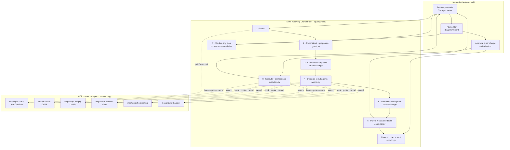

---

## 2. Detection — event-driven, not user-reported

The member never tells the system anything. A scheduled sweep and the carrier's
alert webhook both land on the same code path, which is also what the *Check my
flights* button calls.

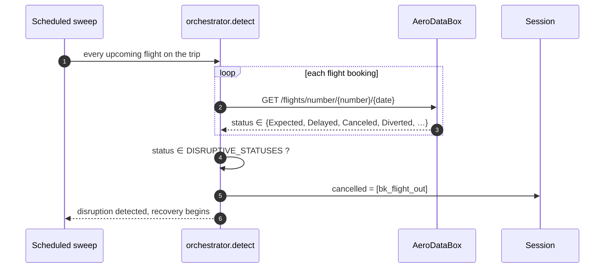

`Canceled` (one *l*), `CanceledUncertain` and `Diverted` are AeroDataBox's own
vocabulary, used verbatim rather than re-mapped. This connector runs **live**
against the real API when `AERODATABOX_API_KEY` is set — reading a flight's
status is free and read-only, so there is no reason to fake it.

---

## 3. The dependency graph — where the reasoning is deterministic

The trip is a DAG, not a list. Two bookings can be adjacent in time and unrelated;
two can be days apart and one cannot happen without the other.

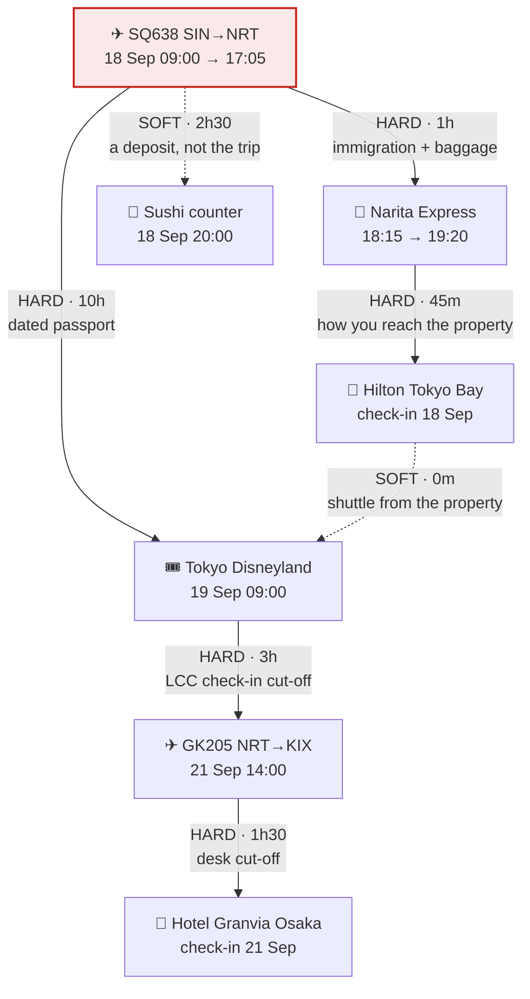

Propagation is one pass in topological order, and the rule is arithmetic:

```
earliest_reachable = free_at(upstream) + edge.min_buffer

if earliest_reachable > deadline(node):
    HARD edge  → BROKEN
    SOFT edge  → AT_RISK
```

Three refinements that took real bugs to find:

| Rule | Why it exists |
| --- | --- |
| `free_at` is a stay's **check-in**, not its check-out | Otherwise a 3-night booking looks like it blocks the whole trip |
| A **replacement is still checked** against its own edges | Otherwise a hotel option can assert a check-in the member cannot make |
| A **dropped** booking is spliced out, not cascaded | Giving up the transfer does not mean giving up the hotel — you still have to get there |

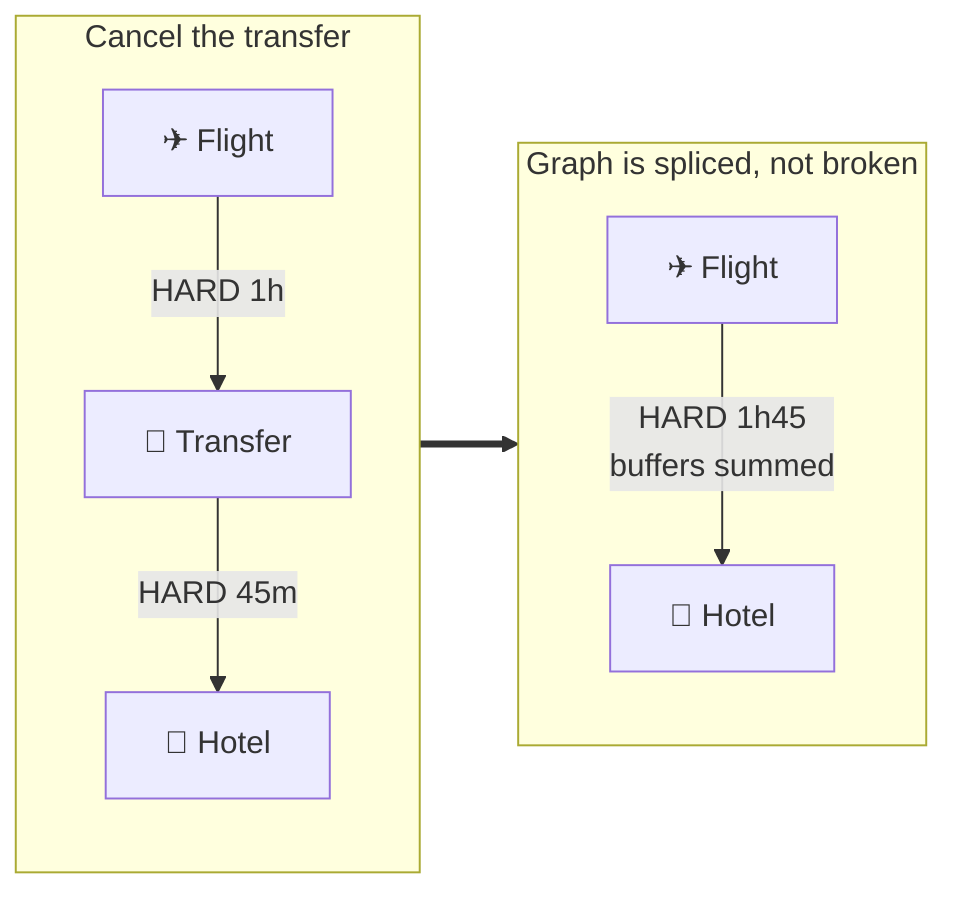

---

## 4. Task creation and agent fan-out

The orchestrator creates tasks **dynamically**, per candidate flight — because a
different arrival breaks a different set of things.

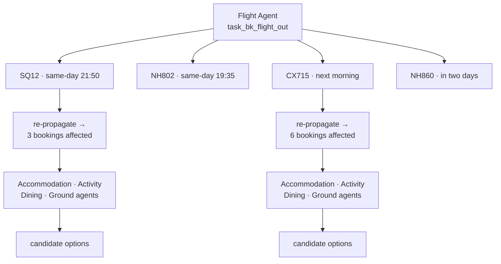

Each task carries the constraint its **own edge** demands, not a constant:

```json
{
  "id": "task_bk_activity_tdl_ft_cx715",
  "agent": "Activity Agent",
  "objective": "Restore “Attraction” given the replacement arrival",
  "constraints": {
    "arrival": "2026-09-19T19:40:00+09:00",
    "arrival_buffer_minutes": 600,
    "must_end_before": "2026-09-21T11:00:00+09:00",
    "priority": "inferred"
  },
  "tools": ["check_availability", "book", "quote_cancellation", "cancel"]
}
```

Agents return **several** options with a reason for every rejection — the
rejections are the part that makes the recommendation believable:

```
flights.search_offers → 4 candidates
  ✓ SQ12 · same-day evening direct        +SGD 180
  ✓ NH802 · earlier same-day direct       +SGD 320
  ✗ ruled out opt_lod_transit: the replacement leaves the same day —
    there is no night to cover
```

---

## 5. Plan assembly — whole answers, not a shortlist

The failure mode this avoids: asking each agent for its single best option and
stapling the results together produces a plan nobody chose, whose totals describe
no trip the member could actually take.

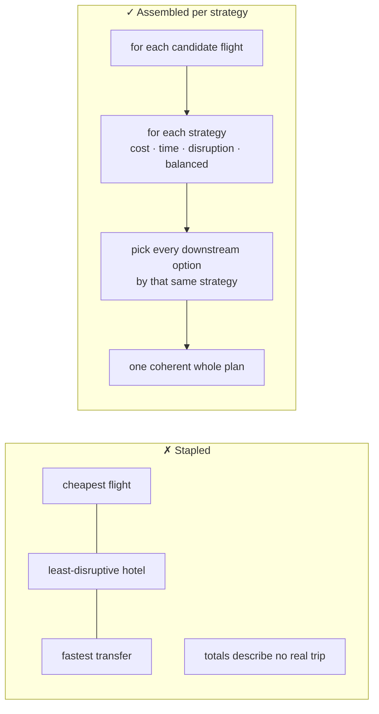

---

## 6. Ranking — five objectives, two mechanisms

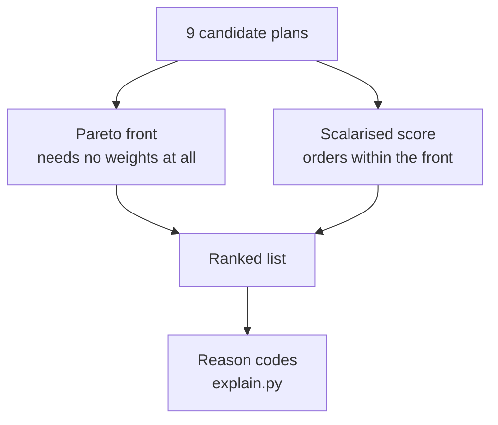

```
score = money
      + hours          × time value
      + bookings moved × switching cost
      + experience given up
      + fragility      × reliability weight
```

| Objective | Guards against |
| --- | --- |
| Money | — |
| Time | — |
| Disruption | Churn for its own sake |
| **Experience** | Winning by quietly deleting the trip |
| **Fragility** | Calling a plan safe because its *flight* is direct |

**Experience** is priced at `1.5 ×` what was paid. A purchase reveals
willingness-to-pay at or *above* the price, so valuing the loss at exactly the
price makes a refund cancel it out perfectly and "delete the day, take the money
back" reads as free.

**Fragility** compounds across legs, and released bookings stay in the product —
giving up a reserved transfer does not make the evening more reliable, it puts
the member on an unmanaged fallback.

### Where the model actually sits

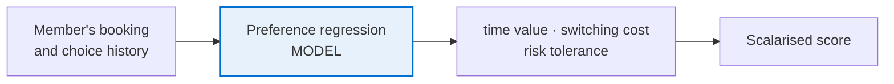

The weight is **never a setting the member picks**. It is regressed from what
they chose the last time they had this trade-off in front of them, and all three
weights move together — a member who waits two days for a fare drop is also a
member who does not mind their hotel being rebooked.

Other seams, marked `# MODEL SEAM` in `agents.py`:

| Seam | The judgement call |
| --- | --- |
| `FlightRecoveryAgent.rank` | Carrier, connection risk and lounge access for *this* member |
| `ActivityRecoveryAgent.rank` | Is an evening pass an acceptable substitute for a full day? |
| Ambiguous buffers | Is 40 minutes really enough at this terminal, at this hour? |
| Explanation prose | Wording the trade-off for a member who is standing in an airport |

---

## 7. Human-in-the-loop — the browser never decides

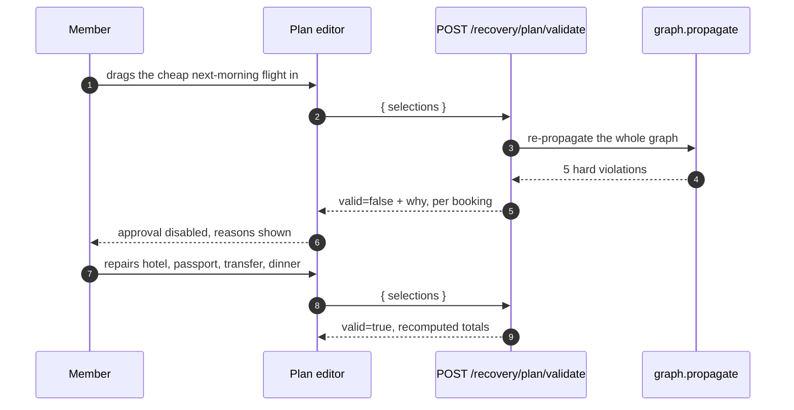

If the frontend were allowed to compute feasibility it would quietly become the
source of truth, and it would be wrong the first time a supplier rule changed.

---

## 8. Execution — a saga, not a batch

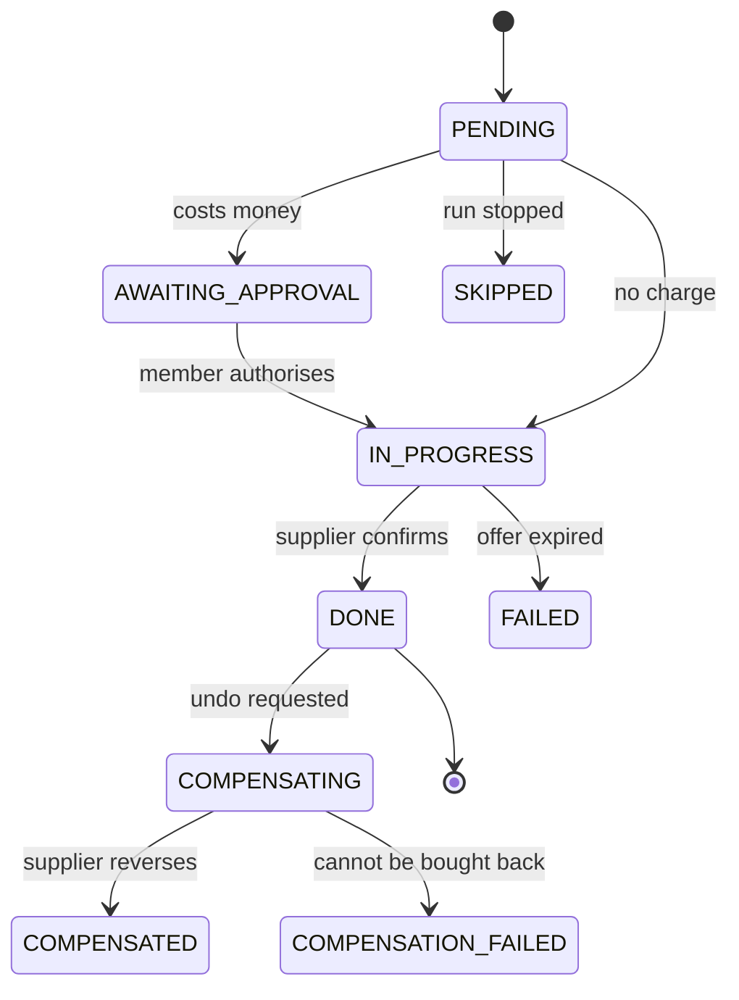

Steps run **one at a time in dependency order** — the hotel amendment is only
correct once the replacement flight is ticketed. Each charge is authorised
individually; the plan-level approval only queues the work.

### Cancel is two different words

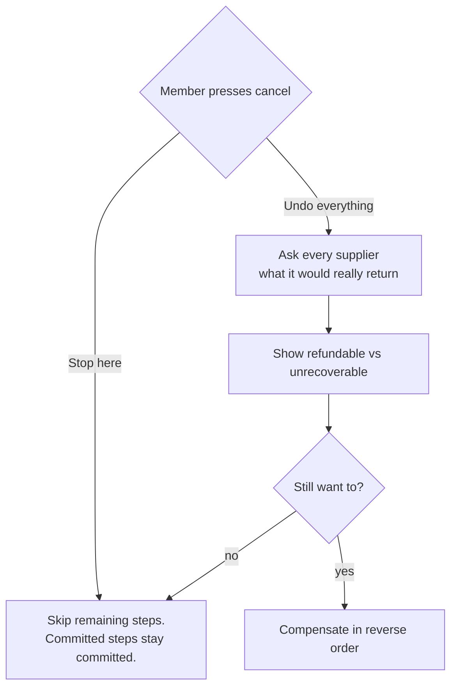

Rollback is quoted before it runs because it is neither free nor always possible:

| Step type | Reversing it |
| --- | --- |
| Flight change (Duffel) | Refund **net of the airline's fee** |
| Hotel amendment (LiteAPI) | Usually full refund |
| Same-day dining cancellation | Nothing comes back |
| A step that **gave a booking up** | Not a refund at all — a re-purchase at today's price, if the inventory still exists |

---

## 9. Accountability

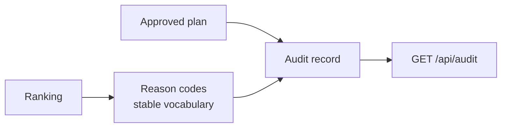

An audit record is written at **approval**, not at execution — the question
worth answering months later is usually "why was this offered", not "did the
booking succeed". It carries the recommendation, the member's actual choice,
every candidate's score, the Pareto front, the weighting in force, and the model
versions that produced them.

The gap between `recommended_plan_id` and `selected_plan_id` is the single most
useful signal the system produces about whether its ranking matches what members
actually want.

---

## 10. Trust boundaries

| Boundary | Rule |
| --- | --- |
| Frontend → feasibility | The browser proposes; the server decides. Always. |
| API data → outbound links | Allowlisted to `https://…americanexpress.com` at the render boundary, so it holds whichever connector produced the link |
| Plan display → plan approval | `Option` is rebuilt from its own field list, so a new field cannot silently default and make the approved plan differ from the displayed one |
| Booking connectors | Fixture-only. A demonstration must not transact against live inventory |
| Execution runs | Never reconstructed from seed data — a missing run returns `410`, because it records transactions that actually happened |

---

## 11. Module map

| Module | Responsibility | Deterministic? |
| --- | --- | --- |
| `domain.py` | Shared vocabulary and types | ✔ |
| `catalog.py` | The member's booking history | ✔ |
| `graph.py` | Dependency graph, propagation, splicing | ✔ |
| `connectors.py` | MCP clients onto real travel APIs | ✔ (live for status) |
| `agents.py` | Five specialized recovery subagents | ✔ + model seams |
| `orchestrator.py` | The workflow, task creation, plan assembly | ✔ |
| `optimizer.py` | Pareto front and scalarised ranking | Weights are inferred |
| `explain.py` | Reason codes and audit records | ✔ |
| `execution.py` | Saga engine and compensation | ✔ |
| `store.py` | Session state and audit trail | ✔ |

---

*Independent AMEX AI Hackathon 2026 concept. Not affiliated with or endorsed by
American Express. Prices, references and availability are synthetic; carriers,
routes, properties and API contracts are real.*
